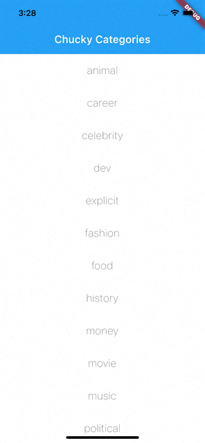

# [Flutter] Networking Layer as a Demo

  

## Overview

### Networking Features

- [x] Chainable Request / Response Methods
- [x] Get/ Post/ Put/ Delete request types
- [x] Networking logger
- [x] Base response management

### App Features

- [x] Custom Status management with BLoCs (Business Logic Components)
- [x] Reusable Error and Loading widgets
- [x] Base assets fetching

## Getting Started

A few resources to get you started if this is your first Flutter project:

- [Lab: Write your first Flutter app](https://flutter.dev/docs/get-started/codelab)
- [Cookbook: Useful Flutter samples](https://flutter.dev/docs/cookbook)

For help getting started with Flutter, view our
[online documentation](https://flutter.dev/docs), which offers tutorials,
samples, guidance on mobile development, and a full API reference.
